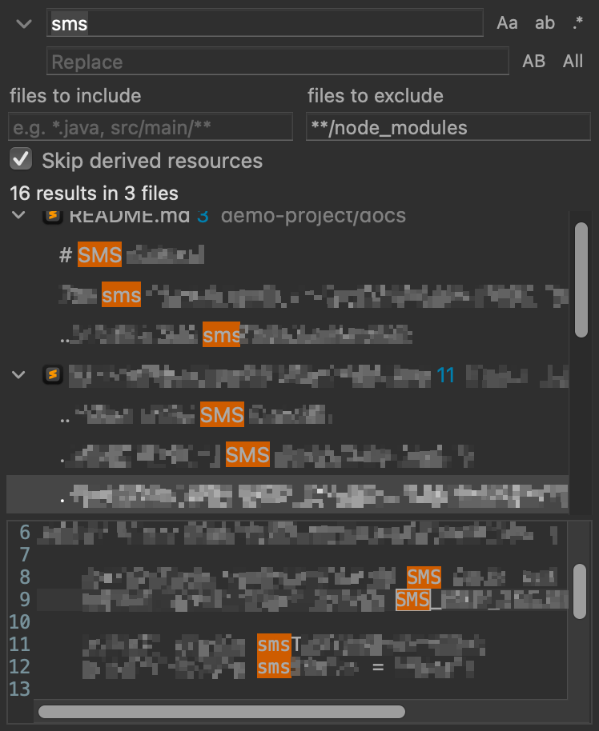

# Eklipse Search

A VS Code style search & replace for Eclipse, as a regular docked view (on the right by default, drag it wherever you
like): search as you type across the workspace, results grouped by file, replace with a live preview.



## Install

Works with Eclipse 2024-03 or newer on macOS, Windows and Linux. Tested so far on macOS only, with Eclipse 2024-03,
2025-12 and 2026-09.

### 1. Install it from the update site

1. *Help > Install New Software...*
2. Paste `https://eliakocher.github.io/eklipse-search/` into *Work with* and press `Enter`.
3. Check *Eklipse Tools > Eklipse Search*. Unchecking *Contact all update sites during install to find required
   software* makes the install faster.
4. *Next*, *Next*, *Finish*.
5. Eclipse asks whether you trust the signer of the plugin, *Eklipse Search*: select it, check *Remember selected
   signers* and confirm with *Trust Selected*. Updates signed with the same key then install without asking.
6. Restart Eclipse when asked.

### 2. Open it, or pick your own shortcut

Open the view with `Ctrl+Alt+Shift+F` (Windows, Linux) / `Cmd+Alt+Shift+F` (macOS) or *Search > Eklipse Search...*.

If the shortcut doesn't work, or you want a different one:

1. *Window > Preferences* (macOS: *Eclipse > Settings...*) *> General > Keys*.
2. Type `Eklipse Search` in the filter field and select the command.
3. Click into *Binding* and press the keys you want. Leave *When* on *In Windows*.
4. Check the *Conflicts* list below: if another command uses the same keys, remove its binding or pick other keys.
5. *Apply and Close*.

See [Usage](#usage) for everything else.

**Update:** *Help > Check for Updates* finds new versions on the update site.

**Uninstall:** *Help > About Eclipse IDE* (*Eclipse > About Eclipse IDE* on macOS) *> Installation Details*, select
*Eklipse Search*, *Uninstall...*.

### Other ways to install

- **From a zip**, e.g. a build of your own (needs a JDK 21, Maven is downloaded automatically):
  `./mvnw verify -DskipTests` (Windows: `mvnw.cmd`) puts `com.eklipse.search.site-1.0.5-SNAPSHOT.zip` into
  `com.eklipse.search.site/target/`. In *Install New Software*, *Add... > Archive...*, select the zip, then continue
  with step 3 above. Your own build isn't signed, so in step 5 Eclipse asks whether you trust unsigned content
  instead. A newer zip installed the same way shows up as an update.

- **Command line**: with Eclipse closed, the p2 director does the same as *Install New Software*:

  ```sh
  # macOS
  /Applications/Eclipse.app/Contents/MacOS/eclipse -nosplash -application org.eclipse.equinox.p2.director \
      -repository https://eliakocher.github.io/eklipse-search/ \
      -installIU com.eklipse.search.feature.feature.group -vmargs -Declipse.p2.unsignedPolicy=allow

  # Linux: same arguments, started with <eclipse folder>/eclipse
  ```

  ```bat
  :: Windows: eclipsec.exe prints the output to the console
  C:\path\to\eclipse\eclipsec.exe -nosplash -application org.eclipse.equinox.p2.director ^
      -repository https://eliakocher.github.io/eklipse-search/ ^
      -installIU com.eklipse.search.feature.feature.group -vmargs -Declipse.p2.unsignedPolicy=allow
  ```

  For a zip, pass `-repository "jar:file:/path/to/com.eklipse.search.site-1.0.5-SNAPSHOT.zip!/"` instead (Windows:
  `jar:file:/C:/path/to/...zip!/`).

- **Drop-in**: copy `com.eklipse.search/target/com.eklipse.search-1.0.5-SNAPSHOT.jar` into the `dropins`
  folder of the Eclipse installation (next to `plugins`; `Eclipse.app/Contents/Eclipse/dropins` on macOS) and restart.
  Some managed installations ignore `dropins`; use the update site there.

- **Your own script**: to rebuild and reinstall in one go, write a small script for your machine (`scripts/` is
  ignored by git, put it there). It builds the update site (`./mvnw verify -DskipTests`), quits Eclipse (the director
  can't change a running installation) and runs the p2 director as above, then starts Eclipse again. Worth knowing:
  - `-listInstalledRoots` shows whether `com.eklipse.search.feature.feature.group` is already installed. To update,
    pass `-uninstallIU` and `-installIU` for it in the same run.
  - Pass the installation's profile with `-profile`, read from `eclipse.p2.profile` in `configuration/config.ini`.
  - Instead of the `eclipse` executable, the director also runs with any Java 21:
    `java -jar <eclipse home>/plugins/org.eclipse.equinox.launcher_*.jar -install <eclipse home> -data @none ...`
  - A successful run prints `Operation completed`; check for it, don't rely on the exit code alone.

## Features

- Search as you type across all open projects, results stream in while the search runs, with a progress bar when it
  takes a moment; once done, the time it took shows next to the result count. Like Quick Search, typing more only
  searches the files that already had matches, and the previous results stay until the new ones arrive
- **Aa** match case, **ab** whole word next to the search field, *Use Regular Expression* in the view's ⋮ menu
- Replace field (toggle with the chevron) with **AB** preserve case and **Replace All**
  - matches are previewed as ~~old~~new in the results
  - regex replacements support `$1`, `${name}`, `$0`/`$&`, `\n`, `\t`
  - replace one match, a file or a selection from the context menu
  - unsaved editors are updated in place and stay unsaved, everything can be undone (Edit > Undo while the view is active)
  - files changed since the search are skipped instead of being replaced at the wrong position
- *Include* (prefilled with `*.java`) / *Exclude* (prefilled with `testbundle.*, **/node_modules`): VS Code
  globs (see below), always visible below the search field. *Skip Derived Resources* in the view's ⋮ menu leaves out
  the build output Eclipse marks as derived, e.g. Maven `target/` folders (on by default). The view remembers what
  you enter there, and the search options, across restarts. The arrow next to each field (or `↓` in it) lists the last
  15 values you used there, a value counts once you leave the field or press `Enter`
- Preview like Quick Search: a click on a result shows its file below the results, with the line of the match
  highlighted and all matches marked; a double-click or `Enter` opens it. Switch it off with *Show Preview* in the
  view's ⋮ menu, then a click opens the editor right away, like in VS Code
- Syntax highlighting in the preview, with what the installed Eclipse has: Java files in the colors of the Java
  editor (JDT), including the semantic highlighting of fields, static members, local variables and so on, which
  follows a moment later once the file is parsed in the background; other languages with the TextMate grammars of
  TM4E (its language pack covers e.g. XML, YAML, JSON, TypeScript, Markdown). Without them the preview stays plain
  text, nothing needs to be installed for the plugin. Files over 1 MB and minified files stay plain too
- The matches are marked in open editors like File Search marks them: highlighted and in the overview ruler, as set
  in *General > Editors > Text Editors > Annotations > Search Results*. The marks go away with the next search or
  when the view is closed
- Results update when files are saved. Dismissed results (Delete) come back with the next search, or when their file
  changes
- Nested Maven modules imported as separate projects are reported once
- Made for a tall, narrow side bar: compact option buttons (with the icons of Eclipse's own find/replace overlay where the installed
  Eclipse ships them, e.g. 2026-09; text labels on older ones like 2024-03), match
  counts next to file names, folders shortened in the middle (`project/…/server/sync`) and lines around the match, so
  the match stays visible, no sideways scrolling (the full path or line is in the tooltip); below ~260px the option
  buttons move under their field. The selected result is gray instead of the accent color, so its match stays
  highlighted
- Works in light and dark theme

Searches run on the platform's text search engine (the one behind Search > File...), which also searches the content
of unsaved editors.

## Usage

The view's tab is called **Search** (with a blue magnifier), the command in the key preferences, the *Search* menu
entry and the plugin in *Installation Details* **Eklipse Search**.

| | |
|---|---|
| Open the view | `Ctrl+Alt+Shift+F` (Windows, Linux) / `Cmd+Alt+Shift+F` (macOS), *Search > Eklipse Search...*, or *Window > Show View > General > Search* (the one with the blue magnifier, Eclipse's own search results view has the same name) |
| Prefill | select text in an editor before opening the view |
| Toggle match case / whole word / regex / preserve case / skip derived resources | `Alt+C` / `Alt+W` / `Alt+R` / `Alt+P` / `Alt+D` (`⌥` on macOS), or click the buttons (regex and derived resources: the view's ⋮ menu) |
| Jump into the results | `↓` in the search field |
| Reuse an include/exclude pattern | the arrow next to the field, or `↓` in it |
| Preview a match | click it: the file shows below the results. With *Show Preview* off, it opens in the editor without leaving the view |
| Open a match | double-click or `Enter` |
| Dismiss | `Delete` / `Backspace` |
| Replace all | *Replace All* or `Ctrl+Enter` / `Cmd+Enter` in the replace field |
| Replace some | select matches or files, context menu *Replace* (while the replace field is shown) |
| Copy | `Ctrl+C` / `Cmd+C` copies the selected results with line numbers (in the preview: the selected text), context menu *Copy Path* copies file paths |
| Search again, clear (also empties the replace field), expand / collapse all | the view's toolbar |
| Regular expression, skip derived resources, show preview | the view's ⋮ menu |

The view opens on the right, stacked with the Outline, in a fresh perspective (or after *Window > Perspective > Reset
Perspective*). Otherwise drag its tab to the side you like once, Eclipse remembers the position.

To use another shortcut, see [Open it, or pick your own shortcut](#2-open-it-or-pick-your-own-shortcut).

### Include / exclude globs

Comma separated, matched case insensitively against workspace paths such as `my-project/src/main/java/Foo.java`:

| Glob | Matches |
|---|---|
| `*.java` | Java files in any folder |
| `src/main/**` | everything below any `src/main` |
| `node_modules` | the folder `node_modules` anywhere, with everything inside |
| `testbundle.*` | the projects (and folders) whose name starts with `testbundle.`, with everything inside |
| `*.{js,ts}` | `.js` and `.ts` files |
| `/my-project/docs` | only below `docs` of the project `my-project` |

## Build

Needs Java 21 to run the build, Maven is downloaded by the wrapper. On Windows use `mvnw.cmd` instead of `./mvnw`.

```sh
./mvnw verify                                 # plugin, unit/integration tests, update site
./mvnw verify -Pui-tests                      # additionally drives the view in a real workbench window (with JDT
                                              # and TM4E for the preview colors) and checks that typing a query with
                                              # 20 000 results or previewing a big Java file doesn't freeze the UI;
                                              # screenshots end up in com.eklipse.search.uitests/target/screenshots
./mvnw verify -Declipse.release=2026-09 -Dbuild.ee=JavaSE-21
                                              # build and test against a newer Eclipse release (needs Java 21)
```

| Module | Content |
|---|---|
| `com.eklipse.search` | the plugin: `core` (search, globs, replace) and `ui` (view, handler) |
| `com.eklipse.search.tests` | headless tests, including searches and replaces in a real workspace |
| `com.eklipse.search.uitests` | UI and performance tests (profile `ui-tests`) |
| `com.eklipse.search.feature` / `.site` | feature and p2 update site |

## Known limitations

- Only tested on macOS so far. On Windows and Linux, `Alt+R` / `Alt+W` / `Alt+P` might open Eclipse's *Run* /
  *Window* / *Project* menus instead of toggling the options; the buttons and the ⋮ menu always work. Feedback welcome.
- Results refresh when a file is saved, not while typing in an editor.
- At most 20 000 results are collected, like VS Code; narrow the search if the limit is hit.
- Files without an Eclipse editor (e.g. `.md` in a bare Eclipse) are opened in the system's default application,
  same as with the File Search.
